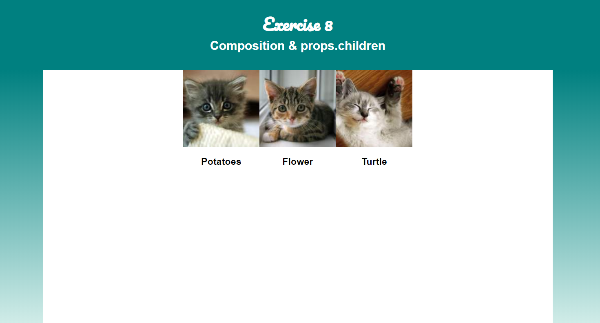
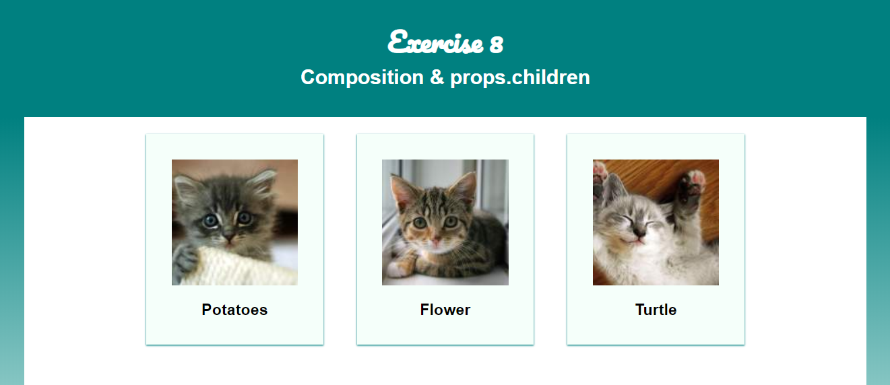

# Exercise 8
## Composition & props.children

Every React component receives a special prop named `children`. This prop contains any elements declared inside of the component. 

This exercise will give you experience working with the special `children` prop.

👉 Start the app for Exercise 8

In a console window, pointed at the root of this project, run `npm run start-exercise-8`.

This should open a browser window pointed at localhost:3000, showing a web app titled "Exercise 8: Composition & props.children", and three adorable kittens. If it doesn't, ask your neighbor for assistance or raise your hand.

👉 Open Exercise.js

All of your work for this exercise will take place in Exercise.js.

### children Prop

Given the following component JSX...

```jsx
function Friends() {
  return (
    <Page>
      <h1>My Friends!</h1>
      <h2>Let's meet them.</h2>
    </Page>
  );
}
```

the `children` prop passed to the `<Page>` component will be an array of two elements - an `h1` and an `h2`.

When the `Page` component wants to render its children, it just needs to evaluate the `children` prop as an expression. For example: 

```jsx
function Page({children}) {
  return (
    <div className="page">
      {children}
    </div>
  );
}
```

would wrap the children in a `div` with class `page`.

When the `Friends` component above is rendered to the DOM, it will render the following markup:

```html
<div class="page">
  <h1>My Friends!</h1>
  <h2>Let's meet them.</h2>
</div>
```

Now it's your turn. Let's build some components that wrap their children.

The App.css for this exercise contains all the styles you'll need, if you define the components correctly.

### `<Page>` Component

Let's write a Page component that we will use to wrap the content on our page.

👉 Add a component named `Page` to `Exercise.js` that wraps its children in `.page` and `.content` `div`s. 

For example, if a component rendered

```html
<Page>
  <h1>Title</h1>
</Page>
```

then the markup emitted should be 

```html
<div class="page">
  <div class="content">
    <h1>Title</h1>
  </div>
</div>
```

You won't notice any changes in your browser, as we're not using the `<Page>` component yet. 

If you get stuck, [see a possible solution here](./SOLUTIONS.md#page).

👉 Modify the `Friends` component to wrap the mapped `<FriendProfile>` elements in a `<Page>` element.

You should notice a difference in the browser this time. If you got everything right, you'll have green gradients down the sides of the page. In addition, our kitten friends will be lined up horizontally instead of vertically.



If you get stuck, [see a possible solution here](./SOLUTIONS.md#friends-with-page).

### `<Card>` Component

Our kittens look a little close together. Let's wrap them in `<Card>` components, to give them a bit more distinction.

👉 Add a component named `Card` to `Exercise.js` that wraps its children in a `.card` `div`. 

For example, if a component rendered

```html
<Card>
  <h1>Title</h1>
</Card>
```

then the markup emitted should be 

```html
<div class="card">
  <h1>Title</h1>
</div>
```

You won't notice any changes in your browser, as we're not using the `<Card>` component yet. 

If you get stuck, [see a possible solution here](./SOLUTIONS.md#card).

👉 Modify the `FriendProfile` component to wrap the `.friend-profile` div in a `<Card>` element.

You should notice a difference in the browser this time. If you got everything right, each of our kitten friends will have a nice card element separating them from the rest.



If you get stuck, [see a possible solution here](./SOLUTIONS.md#friendprofile-with-card).

### Extra Credit

Read more about [composition vs. inheritance in React](https://reactjs.org/docs/composition-vs-inheritance.html)